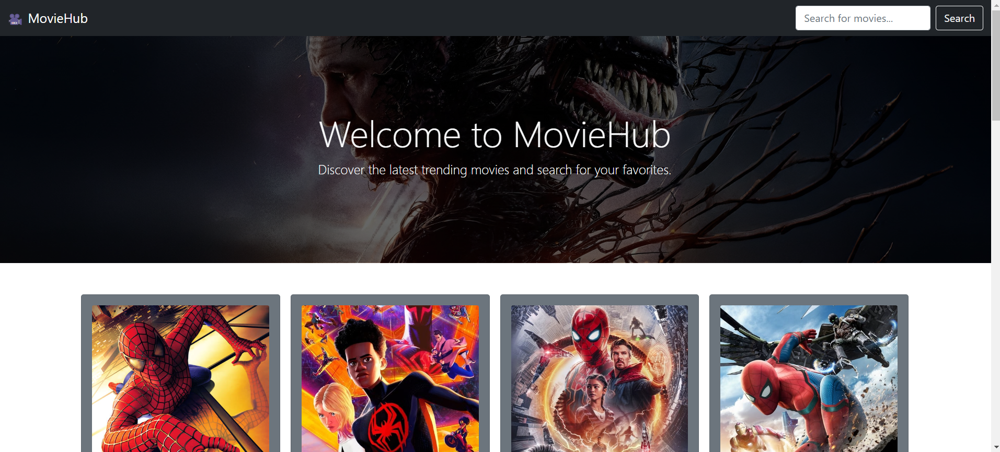
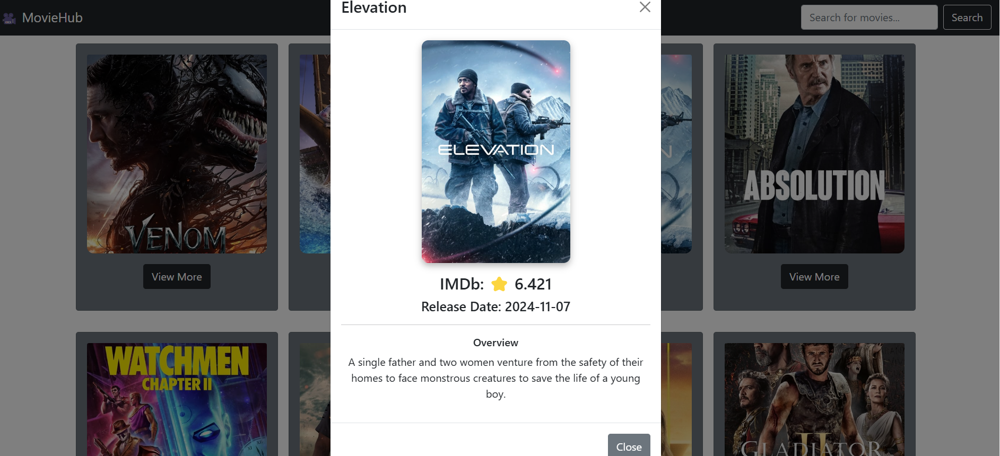

# MovieHub

MovieHub is a dynamic and user-friendly Movie Database (MovieDB) web application built using React JS, React Hooks, Bootstrap, and CSS. It leverages the TMDB (The Movie Database) API to fetch and display information about movies, including details like titles, ratings, release dates, and descriptions.

## Features

- **Browse Popular Movies:** View a list of trending and popular movies fetched in real-time from the TMDB API.
- **Search Functionality:** Find your favorite movies by searching by title.
- **Detailed Movie Information:** Click on a movie to view its detailed information.
- **Responsive Design:** Optimized for different screen sizes using Bootstrap and custom CSS.

## Tech Stack

- **React JS:** For building the user interface.
- **React Hooks:** To manage state and lifecycle methods.
- **Bootstrap:** For responsive and sleek design components.
- **CSS:** Custom styling for enhanced visual appeal.
- **TMDB API:** For fetching up-to-date movie data.

## Setup and Installation

To run this project locally, follow these steps:

1. **Clone the repository:**
   ```bash
   git clone 
   ```

2. **Install dependencies:**
   ```bash
   npm install
   ```

3. **Set up TMDB API key:**
   - Sign up at [TMDB](https://www.themoviedb.org/) if you don’t already have an account.
   - Generate an API key from your account settings.
   - Create a `.env` file in the project root and add your API key:
     ```env
     REACT_APP_TMDB_API_KEY=your_api_key_here
     ```

4. **Run the app:**
   ```bash
   npm start
   ```
   The app will be available at `http://localhost:3000`.

## Usage

- Launch the application using `npm start`.
- Explore movies on the homepage or use the search bar to find specific titles.
- Click on a movie card to view additional details.

## Screenshots

### Home Page
This is the landing page of the MovieHub app, showcasing trending movies.



### Movie Modal
Clicking on "View More" opens a modal with detailed information about the selected movie.




### API URLs

📌 API_URL="https://api.themoviedb.org/3/movie/popular?api_key=<<api_key_here>>"

📌API_IMG="https://image.tmdb.org/t/p/w500/"

📌API_SEARCH="https://api.themoviedb.org/3/search/movie?api_key=<<api_key_here>>&query"
